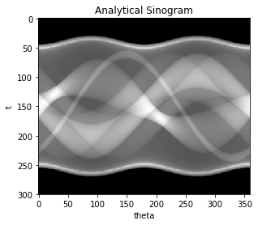

# Exact Sinogram

This project contains an open source Python library for image reconstruction in Axial Computed Tomography (TAC), based on the analytical Radon transform of some classes of phantoms composed of very simple geometric figures: ellipses, squares and rectangles. 
The mathematical phantoms are fictitious images that, sampled with the Radon transform allow to build a signal, called sinogram. Using a phantom gives the advantage to test a reconstruction algorithm on a zero-noise data so the error we get is only due to numerical inaccuracies in the algorithm itself. We calculate the sinogram in two ways : 
- the approximated sinogram, obtained with the Radon transform applied to the discretized phantom; 
- the exact sinogram, obtained with the analytical formula.

Applying the iradon function of the Python library scikit-image on these sinograms we obtain two reconstructed images that we want to compare.
We expect a smaller error on the exact reconstructed image. This turns to be true on continuous regions, but near the discontinuities of the phantom the Gibbs phenomenon prevents us to obtain the same enhancement.

